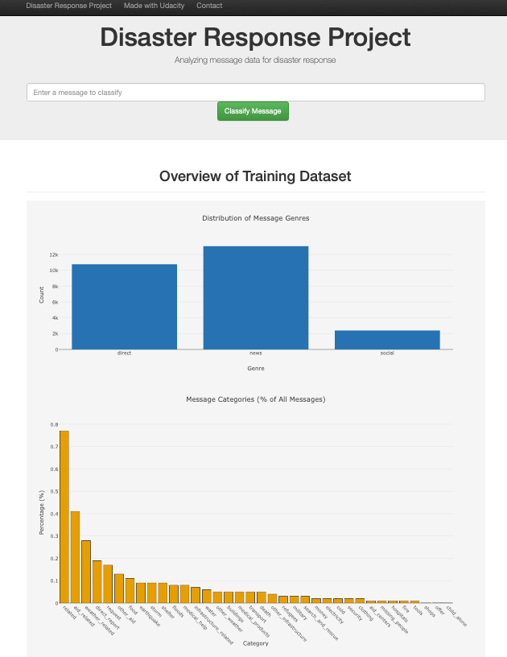
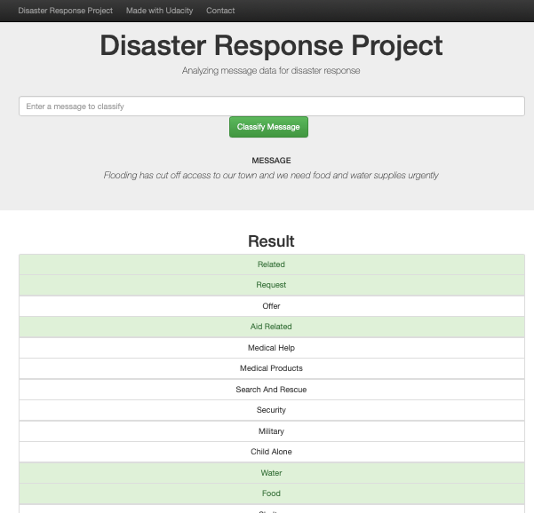

# Disaster Response Pipeline Project

## Project Overview

In the wake of natural disasters, emergency response organizations are inundated with millions of communications while resources remain limited. This project addresses this critical challenge by developing a machine learning application that automatically categorizes disaster messages, ensuring they reach the appropriate response agencies without delay.

The system employs Natural Language Processing (NLP) techniques and supervised learning algorithms to analyze incoming messages and classify them into 36 distinct categories relevant to disaster response efforts (e.g., water, medical supplies, search and rescue). This intelligent classification enables response teams to efficiently allocate resources and coordinate relief efforts during times of crisis.





<sub>*Example classification of a flood-related message. The model correctly identifies multiple relevant categories including Related, Request, Aid Related, Water, Food, and Direct Report (not visible in screenshot).*</sub>

## Technical Architecture

The project is structured around three core components, each addressing a distinct aspect of the data science pipeline:

### 1. ETL Pipeline (Extract, Transform, Load)

The `process_data.py` script performs comprehensive data preprocessing:

- Extracts message data and category labels from CSV files
- Merges datasets and removes redundancies
- Transforms category values into a structured binary format
- Loads processed data into an SQLite database for subsequent analysis

This data engineering step ensures that raw disaster messages are converted into a clean, structured format suitable for machine learning applications.

### 2. Machine Learning Pipeline

The `train_classifier.py` script implements a sophisticated text classification system:

- Incorporates text preprocessing techniques including tokenization, lemmatization, and stop word removal
- Engineers features using TF-IDF (Term Frequency-Inverse Document Frequency) vectorization
- Builds a multi-output classification model to simultaneously predict multiple target variables
- Optimizes model hyperparameters using GridSearchCV
- Evaluates model performance across multiple metrics (precision, recall, F1-score)
- Serializes the trained model for deployment

The pipeline addresses the inherent complexities of natural language and the multi-label nature of disaster response categorization.

### 3. Web Application

The Flask-based web application (`run.py`) provides an intuitive interface for:

- Real-time message classification through a user-friendly input form
- Visual data exploration through interactive Plotly visualizations
- Statistical insights into the distribution of message categories
- Immediate classification results displayed in an accessible format

This interface bridges the gap between advanced machine learning algorithms and emergency responders who may lack technical expertise.

## Implementation Guide

### Prerequisites

- Python 3.6 or higher
- Familiarity with terminal/command line operations
- Required libraries (installable via pip):
  ```
  pandas
  numpy
  sqlalchemy
  scikit-learn
  nltk
  flask
  plotly
  joblib
  ```

### Installation

1. Clone this repository to your local machine:
   ```bash
   git clone https://github.com/Soriano-R/disaster-response-pipeline.git
   cd disaster-response-pipeline
   ```

2. Install dependencies:
   ```bash
   pip install -r requirements.txt
   ```

### Execution Workflow

1. Process the raw data to create a structured database:
   ```bash
   python data/process_data.py data/disaster_messages.csv data/disaster_categories.csv data/DisasterResponse.db
   ```

2. Train the classification model:
   ```bash
   python models/train_classifier.py data/DisasterResponse.db models/classifier.pkl
   ```

3. Launch the web application:
   ```bash
   cd app
   python run.py
   ```

4. Navigate to http://localhost:3001/ in your web browser to interact with the application

## Research Findings

The implemented model demonstrates strong performance across several metrics:

- Achieves high accuracy (94.4%) across the test dataset
- Exhibits robust F1-scores for high-frequency categories (related: 0.93, aid_related: 0.80)
- Demonstrates the effectiveness of NLP techniques in humanitarian contexts
- Reveals pattern recognition capabilities across diverse message sources (direct, news, social)

However, the research also highlights challenges with class imbalance, where rare categories (e.g., infrastructure_related, tools) show lower performance metrics. This finding aligns with established machine learning literature on imbalanced classification problems.

## Future Research Directions

This project opens several avenues for continued research:

- Integration of pre-trained language models (BERT, RoBERTa) to enhance semantic understanding
- Exploration of data augmentation techniques to address class imbalance
- Implementation of active learning methodologies to reduce annotation requirements
- Development of multilingual capabilities to support international disaster response
- Expansion of the system to incorporate multi-modal data (text, images, geolocation)

## Acknowledgments

- This research builds upon the data science curriculum developed by Udacity
- The dataset was generously provided by Figure Eight (now Appen), containing real messages sent during disaster events
- The project contributes to the growing body of work applying artificial intelligence to humanitarian challenges

## Project Structure

```
disaster-response-pipeline/
│
├── app/
│   ├── run.py                  # Flask web application
│   └── templates/
│       ├── go.html             # Classification result page
│       └── master.html         # Main page
│
├── data/
│   ├── disaster_messages.csv   # Raw message data
│   ├── disaster_categories.csv # Message categories
│   ├── process_data.py         # ETL pipeline
│   └── DisasterResponse.db     # SQLite database
│
├── models/
│   ├── train_classifier.py     # ML pipeline
│   └── classifier.pkl          # Trained model
│
├── screenshots/                # Application screenshots
├── README.md                   # Project documentation
└── requirements.txt            # Dependencies
```
